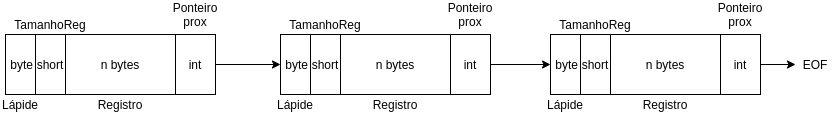

# CRUD Genérico para manipulação de arquivos - Class Comentarios :rocket:

- CRUD feito para atender a manipulação de arquivos como memória externa

1. Interface Registro
  > A interface registro é responsável por criar um escopo
  > para a futura manipulação de dos registros por outra classe.
  
  O método **toByteArray()** deve ser implementado pelas classes que implementam a interface registro,
  essa é responsável por transformar um objeto em um vetor de bytes.
  O método **fromByteArray(byte[] ba)** deve ser implementado pelas classes que implementam a interace registro,
  essa é responsável por receber um vetor de bytes e transformar em um objeto.  
  
2. Estrutura dos Registros
  > * Os registros na memória externa - arquivo - são estruturados como uma **lista encadeada**.
  > * O ponteiro para o próximo registro é descrito por um valor inteiro (4 bytes) no final de cada registro.
  > * Cada registro tem uma lápide de 1 byte que marca se o registro foi excluído. 0 - não excluído 1 - excluído
  > * Cada registro possuí um short indicando o tamanho do array de bytes seguintes
  > * O registro possuí então, o vetor de bytes relacionado ao objeto escrito
 
  

4. 
